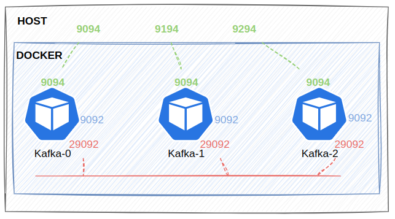

## Overview

Hướng dẫn này giúp bạn cài đặt một cụm Kafka gồm 3 nodes sử dụng docker có mô hình như sau:



## 1. Create network

```shell
docker network create streaming-network --driver bridge
```

## 2. Run kafka

```shell
docker compose up -d
```

**Check Status & Logs**

```shell
docker compose ps
docker compose logs kafka_basic-0 -f -n 100
```

**Testing**

Run inside kafka's containers

```shell
docker exec -ti kafka_basic-0 bash
```

Producer

```shell
kafka_basic-console-producer --producer.config /etc/kafka_basic/producer.properties --bootstrap-server kafka_basic-0:29092,kafka_basic-1:29092,kafka_basic-2:29092 --topic test
```

Consumer

```shell
kafka_basic-console-consumer --consumer.config /etc/kafka_basic/consumer.properties --bootstrap-server kafka_basic-0:29092,kafka_basic-1:29092,kafka_basic-2:29092 --topic test --from-beginning
```

## 3. Monitor

[akqh](http://localhost:8180)

```
username: admin
password: Unigap@2024
```

## References

[Quick Start for Confluent Platform](https://docs.confluent.io/platform/current/platform-quickstart.html#quick-start-for-cp)

[Docker Image Reference for Confluent Platform](https://docs.confluent.io/platform/current/installation/docker/image-reference.html#docker-image-reference-for-cp)

[akhq configuration](https://akhq.io/docs/configuration/brokers.html)

[Docker Image Configuration Reference for Confluent Platform](https://docs.confluent.io/platform/current/installation/docker/config-reference.html)
